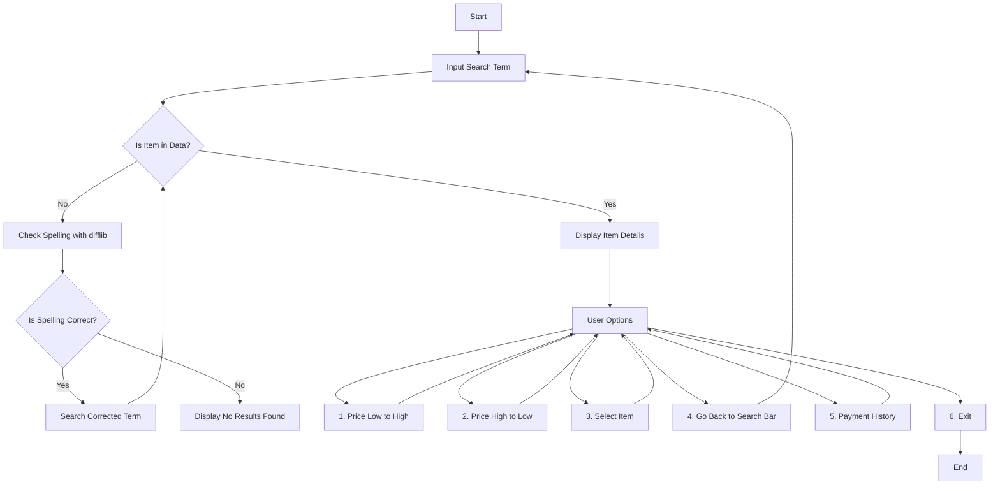
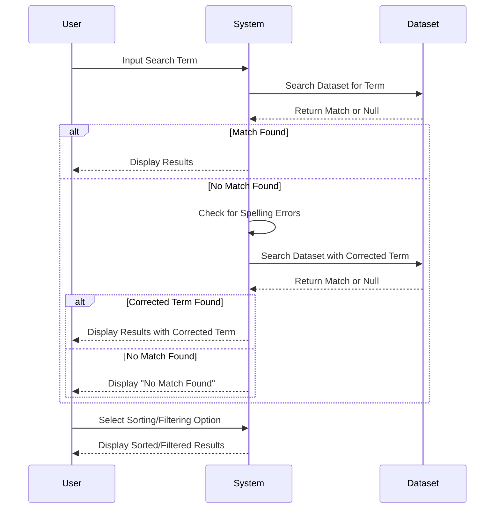

---

# Online Shopping System

## Overview

The **Online Shopping System** is a Python-based application designed to streamline the search and selection of products within a shopping environment. The system provides intelligent search capabilities that not only find items but also suggest correct spelling if a misspelled term is entered. This project effectively utilizes Python's file handling and error correction libraries to enhance the user experience by offering search suggestions and allowing users to sort and filter search results according to their preferences.

## Features

- **Search with Auto-Correction:** 
  - The system checks if the input search term matches any item in the provided dataset.
  - If no exact match is found, the system uses the `diff` library to identify and correct spelling errors, then re-attempts the search with the corrected term.
  - The application calculates the probability of the corrected term being accurate based on the provided dataset.

- **Sort and Filter Options:**
  - **Price Low to High**
  - **Price High to Low**
  - **Select Item**
  - **Go Back to Search Bar**
  - **View Payment History**
  - **Exit**

- **Data Management:**
  - Each product entry contains detailed specifications, such as model number, capacity, RPM, color, product dimensions, energy efficiency, and voltage.
  - The application handles data effectively using Python’s file handling capabilities, making it easy to manage and retrieve large datasets.

## How It Works

## Code Flow

The system operates as follows:



### Nodes & Code Logic

1. **Start**: The program begins execution.
2. **Input Search Term**: The user inputs the term they want to search for.
3. **Is Item in Data?**: The system checks if the input term matches any item in the dataset.
    - **Yes**: Display the item details.
    - **No**: Proceed to spelling correction using `difflib`.
4. **Check Spelling with difflib**: The system corrects the spelling of the search term.
5. **Is Spelling Correct?**: The system checks if the corrected spelling matches any item.
    - **Yes**: The system searches again with the corrected term.
    - **No**: Display a message that no results were found.
6. **User Options**: Once an item is displayed, the user can choose from the following options:
    - **Price Low to High**: Sort items by price from low to high.
    - **Price High to Low**: Sort items by price from high to low.
    - **Select Item**: Select a specific item.
    - **Go Back to Search Bar**: Return to the search bar for a new query.
    - **Payment History**: Display the user's payment history.
    - **Exit**: Exit the system.


### Example Data Entry

- **Product:** Whirlpool Washing Machine
- **Details:** 
  - Model: WHITEMAGIC ROYAL 7.0 GENX
  - Capacity: 7.0 Kg
  - RPM: 740
  - Color: Grey
  - Product Specifications:
    - Dimensions: 56Dx54Wx87W
    - Energy Efficiency: 5 Star
    - Voltage: 200V
  - **Price:** 14,890 INR

### Code Flow Visualization



## Getting Started

### Prerequisites

Ensure that Python is installed on your system. You will also need the `diff` library for spell-checking.

### Installation

Clone the repository:

```bash
git clone https://github.com/Khushal-Savalakha/Online_Shopping_System.git

```

Navigate to the project directory suppose:

```bash
cd Online_Shopping_System
```

Install the required libraries:

```bash
pip install diff
```

### Running the Application

Execute the Python scripts to start the search process:

```bash
python Online_Shopping_System_Menu.py
```

## Contributing

Contributions are welcome! Please feel free to submit a pull request or open an issue for any enhancements or bug fixes.

## License

This project is licensed under the MIT License .

---
