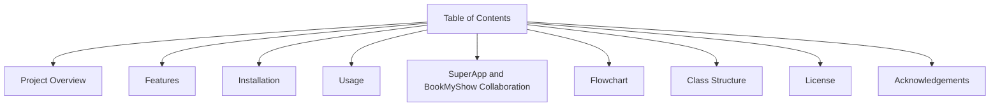
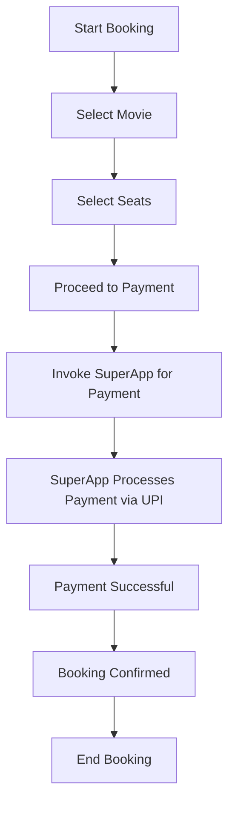
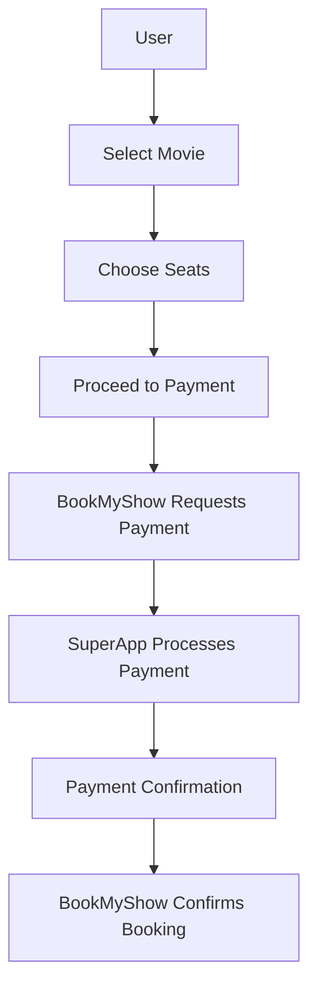

---

# BookMyShow

BookMyShow is a Command-Line User Interface (CUI) application designed for movie ticket booking. It operates in conjunction with `SuperApp`, a digital wallet connected to a bank, enabling transactions through a UPI option. This README provides a detailed guide to the application's structure, flow, and usage.

---

## Table of Contents

1. Project Overview
2. Features
3. Installation
4. Usage
5. SuperApp and BookMyShow Collaboration
6. Flowchart
7. Class Structure
8. License
9. Acknowledgements

---

## Project Overview

The `BookMyShow` application is a CLI-based tool for booking movie tickets, integrated with `SuperApp` for payment processing through UPI.

---

## Features

- **Movie Selection:** Choose from a list of movies.
- **Seat Booking:** Select your preferred seats.
- **Payment:** Use `SuperApp` wallet with UPI integration for payments.
- **Booking Confirmation:** Get a confirmation once booking is complete.

---

## Installation

1. Clone the repository.
2. Navigate to the project directory.
3. Compile the Java files.
4. Run the application.

---

## Usage

1. Start the `BookMyShow` application.
2. Choose a movie and select seats.
3. Use `SuperApp` for payment.
4. Confirm your booking and receive a ticket.

---

## SuperApp and BookMyShow Collaboration

The `SuperApp` functions as a digital wallet connected to a bank account, facilitating UPI payments. `BookMyShow` leverages this integration to process movie ticket payments.

### Flow of Collaboration

1. **User Action:** Select a movie and proceed to payment.
2. **BookMyShow Interaction:** Requests payment.
3. **SuperApp Wallet:** Invoked to process payment through UPI.
4. **UPI Transaction:** Payment is processed and confirmed.
5. **Confirmation:** `BookMyShow` confirms the booking once payment is successful.

### Table of Interaction

| **Step**         | **BookMyShow Action**                  | **SuperApp Action**                  | **Result**                              |
|------------------|----------------------------------------|--------------------------------------|-----------------------------------------|
| 1. Movie Selection | Displays list of movies                | --                                   | User selects a movie                    |
| 2. Seat Booking  | Prompts user to select seats           | --                                   | User selects seats                      |
| 3. Payment       | Requests payment                       | Invokes `SuperApp`                   | UPI transaction initiated               |
| 4. UPI Processing | --                                     | Processes payment via UPI            | Payment confirmed                       |
| 5. Confirmation  | Confirms booking                       | --                                   | User receives ticket confirmation       |

---

## Flowchart

### Booking Process

### SuperApp Interaction

---

## Class Structure

- **BookMyShow**
  - Manages movie selection, seat booking, and payment requests.
- **SuperApp**
  - Acts as a wallet, handling payments through UPI and confirming transactions.

---

## License

This project is licensed under the MIT License.

---

This version includes additional flowcharts to visualize the interactions between `BookMyShow` and `SuperApp`. Let me know if there's anything else you'd like to add or refine!
